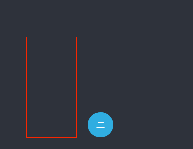

##      Stack

###     需要实现的方法有如下：

* 			push(ele)  向Stack中添加一个值
*    		pop()         删除Stack中栈顶的值并返回
*      	peek()        取出Stack中栈顶的值
*       clear()       清空Stack
*       isEmpty()     返回Stack是否为空
*       size()        返回Stack的大小

###     如何实现：

1.      创建一个class
```javascript
class Stack {
  constructor() {     // 构造函数
    this.items = [];  // 创建一个空数组 用来存储Stack中的数据
  }
}
```

2.      push
```javascript
push(element) {
  this.items.push(element);      // 将参数push至数组尾部
}
```

3.      pop
```javascript
pop() {

  return this.items.pop();          // 只是调用原生Array的pop即可。
}
```

4.      peek
```javascript
peek() {

  return this.items.slice(-1)[0];  // slice取出来的是一个数组 然后取出数组中的第0个 就是数组尾部的子项
}
```

5.      clear
```javascript
clear() {

  this.items.length = 0;           // 给length赋值为0 间接的清空了数据
}
```

6.      isEmpty
```javascript
isEmpty() {

  return !this.items.length;      // 返回length是否大于0
}
```

7.      size
```javascript
size() {

  return this.items.length;       // 返回length
}
```
<!-- demo -->

